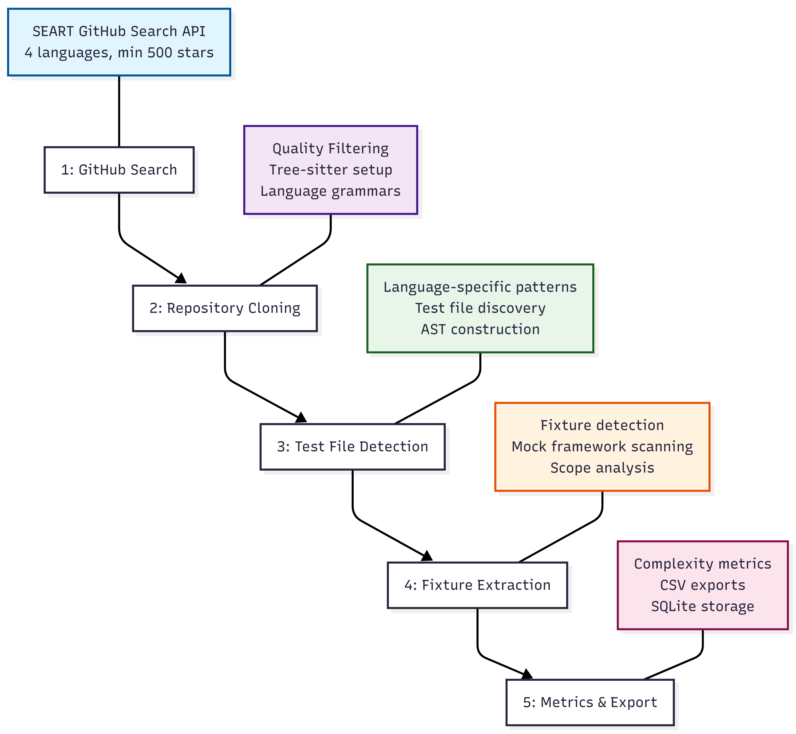

# FixtureDB — Corpus Collection Pipeline

[](https://github.com/joao-almeida/icsme-nier-2026/actions/workflows/coverage.yml)


Replication package for the paper:

> **FixtureDB: A Multi-Language Dataset of Test Fixture Definitions**
> João Almeida, Andre Hora  
> *ICSME 2026 — Tool Demonstration and Data Showcase Track*  
> TODO: add DOI once published

This repository contains the extraction pipeline that builds FixtureDB.
The dataset itself (SQLite database + CSV exports) is archived separately
on Zenodo at **TODO: Zenodo DOI**.

---

## Dataset at a Glance

| Metric | Value |
|--------|-------|
| **Repositories** | 160 (with ≥1 fixture) |
| **Fixture Definitions** | ~40,700 |
| **Mock Framework Usages** | ~12,800 |
| **Test Files** | ~228,000 |
| **Languages** | Python (4.9K), Java (11.2K), JavaScript (5.5K), TypeScript (19K) fixtures |
| **Collection Date** | April 1–2, 2026 |
| **Database Size** | ~1–3 GB (with raw source) |
| **CSV Export** | ~100–200 MB (quantitative metrics only) |

---

## Dataset Collection Details

| Property | Value |
|----------|-------|
| **SEART GitHub Search Extraction** | April 1–2, 2026 |
| **Repository Selection** | Minimum 500 stars |
| **Languages** | Python, Java, JavaScript, TypeScript |
| **GitHub API Version** | v3 REST API |
| **Required Tools** | See [requirements.txt](requirements.txt) for exact versions |
| **Tree-sitter** | Grammar support for all 4 languages |
| **Complexity Analysis** | Lizard + language-specific cognitive complexity |
| **Python Environment** | 3.8+ |

### Collection Pipeline

The dataset was constructed through a five-phase pipeline:

1. **GitHub Search** (April 1–2, 2026) — Query SEART API for repositories by language and star count
2. **Repository Cloning** — Download full source code for all matching repositories
3. **Test File Detection** — Discover test files using language-specific patterns and parse with Tree-sitter
4. **Fixture Extraction** — Identify fixture definitions and scan for mock framework usage
5. **Metrics & Export** — Compute complexity metrics, validate quality, generate CSV exports



See [docs/collection-pipeline.md](docs/collection-pipeline.md) for detailed pipeline walkthrough and [docs/data/data-collection.md](docs/data/data-collection.md) for reproducibility steps. For exact tool versions, see [requirements.txt](requirements.txt).

---

## Documentation

Complete documentation has been organized into dedicated files in the [docs/](docs/) folder:

### Quick Navigation

| Document | Purpose |
|----------|---------|
| [docs/INDEX.md](docs/INDEX.md) | **Start here** — overview and quick navigation |
| [docs/collection-pipeline.md](docs/collection-pipeline.md) | Collection pipeline phases with Mermaid diagram |

### Getting Started

| Document | Purpose |
|----------|---------|
| [docs/getting-started/intro.md](docs/getting-started/intro.md) | What is FixtureDB and why it matters |
| [docs/getting-started/repository-structure.md](docs/getting-started/repository-structure.md) | Project layout and organization |
| [docs/getting-started/setup.md](docs/getting-started/setup.md) | Installation and dependencies |
| [docs/getting-started/running.md](docs/getting-started/running.md) | Command reference for pipeline operations |

### Dataset & Data Collection

| Document | Purpose |
|----------|---------|
| [docs/data/data-collection.md](docs/data/data-collection.md) | Five-phase pipeline walkthrough |
| [docs/data/storage.md](docs/data/storage.md) | Disk usage and database growth |
| [docs/data/csv-export-guide.md](docs/data/csv-export-guide.md) | CSV export format and columns |
| [docs/data/csv-user-guide.md](docs/data/csv-user-guide.md) | CSV exports for non-SQL users |

### Architecture & Technical Reference

| Document | Purpose |
|----------|---------|
| [docs/architecture/database-schema.md](docs/architecture/database-schema.md) | Complete ERD and table specifications |
| [docs/architecture/configuration.md](docs/architecture/configuration.md) | All tunable parameters |
| [docs/architecture/detection.md](docs/architecture/detection.md) | Tree-sitter AST and mock detection |
| [docs/architecture/data-pipeline-overview.md](docs/architecture/data-pipeline-overview.md) | Detailed pipeline architecture |
| [docs/architecture/metrics-reference.md](docs/architecture/metrics-reference.md) | Metrics definitions and computation |

### Usage & Analysis

| Document | Purpose |
|----------|---------|
| [docs/usage/reproducing.md](docs/usage/reproducing.md) | Exact corpus replication with pinned commits |
| [docs/usage/usage.md](docs/usage/usage.md) | SQL query examples and data access |
| [docs/usage/fixture-patterns-reference.md](docs/usage/fixture-patterns-reference.md) | Fixture types and classification patterns |

### Reference

| Document | Purpose |
|----------|---------|
| [docs/reference/limitations.md](docs/reference/limitations.md) | Known constraints and validation status |
| [docs/reference/license.md](docs/reference/license.md) | MIT (code) and CC BY 4.0 (dataset) |
| [docs/reference/testing.md](docs/reference/testing.md) | Test suite and validation |
| [docs/reference/references.md](docs/reference/references.md) | Academic citations and sources |

## Quick start

```bash
# Install dependencies
pip install -r requirements.txt

# Set up your GitHub token
cp .env.example .env
# Edit .env and add your GITHUB_TOKEN

# Initialize the database
python pipeline.py init

# Run the full pipeline (all languages)
python pipeline.py run
```

For detailed setup, see [docs/getting-started/setup.md](docs/getting-started/setup.md).

## What is FixtureDB?

FixtureDB is a structured dataset of **test fixture definitions** extracted from
open-source software repositories on GitHub across **Python, Java, JavaScript,
and TypeScript**.

A *test fixture* is any code that prepares or tears down state before or after a test runs.
For each fixture, the dataset records structural metadata (size, complexity, scope, type)
and mock framework usage.

**Why it matters:** Prior empirical work on fixtures is exclusively Java-based. FixtureDB is the
first cross-language resource treating the fixture as its primary unit of analysis.

See [docs/getting-started/intro.md](docs/getting-started/intro.md) for the full overview.

### Data Quality & Testing

FixtureDB focuses exclusively on **quantitative, objective aspects** of test fixtures:

- **Framework Detection**: Syntactically unambiguous markers only (decorators, annotations, attributes)
  - Python: `@pytest.fixture`, `setUp()`/`tearDown()` methods
  - Java: `@Before`/`@After` annotations
  - JavaScript/TypeScript: Mocha/Jest `beforeEach()`/`afterEach()` and related patterns

- **Structural Metrics**: Lines of code, cyclomatic complexity, parameter counts, fixture type/scope
- **Mock Framework Usage**: Detection of mock object patterns within fixture code

**CSV exports** contain quantitative metrics. The SQLite database includes additional internal infrastructure for reproducibility and future research.

All fixture detectors include **comprehensive unit tests** ([tests/test_framework_detection.py](tests/test_framework_detection.py)) verifying:
- Correct framework identification across supported languages
- AST-based detection accuracy
- Cross-language consistency

See [docs/architecture/detection.md](docs/architecture/detection.md) for technical details on detection algorithms.

---

## Exploratory Data Analysis (EDA)

The following visualizations provide an overview of the FixtureDB corpus:

### Corpus Composition

**Repository Distribution and Pipeline Status**


### Repository Timeline & Activity

**Creation Timeline and Activity Patterns**


### Fixture Overview

**Fixture Distribution and Scope Patterns**


### Mocking Practices

**Mock Usage and Framework Diversity**


### Fixture Complexity Analysis

**Nesting, Reuse, and Complexity Patterns**


