# FixtureDB — Corpus Collection Pipeline

Replication package for the paper:

> **FixtureDB: A Multi-Language Dataset of Test Fixture Definitions from Open-Source Software**  
> João Almeida, Andre Hora  
> *ICSME 2026 — Tool Demonstration and Data Showcase Track*  
> TODO: add DOI once published

This repository contains the extraction pipeline that builds FixtureDB.
The dataset itself (SQLite database + CSV exports) is archived separately
on Zenodo at **TODO: Zenodo DOI**.

---

## Documentation

Complete documentation has been organized into dedicated files in the [docs/](docs/) folder:

| Document | Purpose |
|----------|---------|
| [docs/INDEX.md](docs/INDEX.md) | **Start here** — overview and quick navigation |
| [docs/01-intro.md](docs/01-intro.md) | What is FixtureDB and why it matters |
| [docs/02-repository-structure.md](docs/02-repository-structure.md) | Project layout and organization |
| [docs/03-database-schema.md](docs/03-database-schema.md) | Complete ERD and table specifications |
| [docs/04-data-collection.md](docs/04-data-collection.md) | Five-phase pipeline walkthrough |
| [docs/05-storage.md](docs/05-storage.md) | Disk usage and database growth |
| [docs/06-setup.md](docs/06-setup.md) | Installation and dependencies |
| [docs/07-running.md](docs/07-running.md) | Command reference for pipeline operations |
| [docs/08-reproducing.md](docs/08-reproducing.md) | Exact corpus replication with pinned commits |
| [docs/09-usage.md](docs/09-usage.md) | SQL query examples and data access |
| [docs/10-configuration.md](docs/10-configuration.md) | All tunable parameters |
| [docs/11-detection.md](docs/11-detection.md) | Tree-sitter AST and mock detection |
| [docs/12-limitations.md](docs/12-limitations.md) | Known constraints and validation status |
| [docs/13-license.md](docs/13-license.md) | MIT (code) and CC BY 4.0 (dataset) |

## Quick start

```bash
# Install dependencies
pip install -r requirements.txt

# Set up your GitHub token
cp .env.example .env
# Edit .env and add your GITHUB_TOKEN

# Initialize the database
python pipeline.py init

# Run the full pipeline (all languages)
python pipeline.py run
```

For detailed setup, see [docs/06-setup.md](docs/06-setup.md).

## What is FixtureDB?

FixtureDB is a structured dataset of **test fixture definitions** extracted from
open-source software repositories on GitHub across **Python, Java, JavaScript,
TypeScript, and Go**.

A *test fixture* is any code that prepares or tears down state before or after a test runs.
For each fixture, the dataset records structural metadata (size, complexity, scope, type)
and mock framework usage.

**Why it matters:** Prior empirical work on fixtures is exclusively Java-based. FixtureDB is the
first cross-language resource treating the fixture as its primary unit of analysis.

See [docs/01-intro.md](docs/01-intro.md) for the full overview.

### Data Quality & Testing

FixtureDB focuses exclusively on **quantitative, objective aspects** of test fixtures:

- **Framework Detection**: Syntactically unambiguous markers only (decorators, annotations, attributes)
  - Python: `@pytest.fixture`, `setUp()`/`tearDown()` methods
  - Java: `@Before`/`@After` annotations

  - Go: `TestMain()` function, `SetupSuite()`/`SetupTest()` methods (testify)
  - JavaScript/TypeScript: AVA's unique `test.before()`/`test.after()` pattern

- **Structural Metrics**: Lines of code, cyclomatic complexity, parameter counts, fixture type/scope
- **Mock Framework Usage**: Detection of mock object patterns within fixture code

All fixture detectors include **comprehensive unit tests** ([tests/test_framework_detection.py](tests/test_framework_detection.py)) verifying:
- Correct framework identification across 6 languages
- AST-based detection accuracy
- Cross-language consistency

See [docs/11-detection.md](docs/11-detection.md) for technical details on detection algorithms.

---

## Exploratory Data Analysis (EDA)

The following visualizations provide an overview of the FixtureDB corpus:

### Corpus Composition

**Repository Distribution and Pipeline Status**

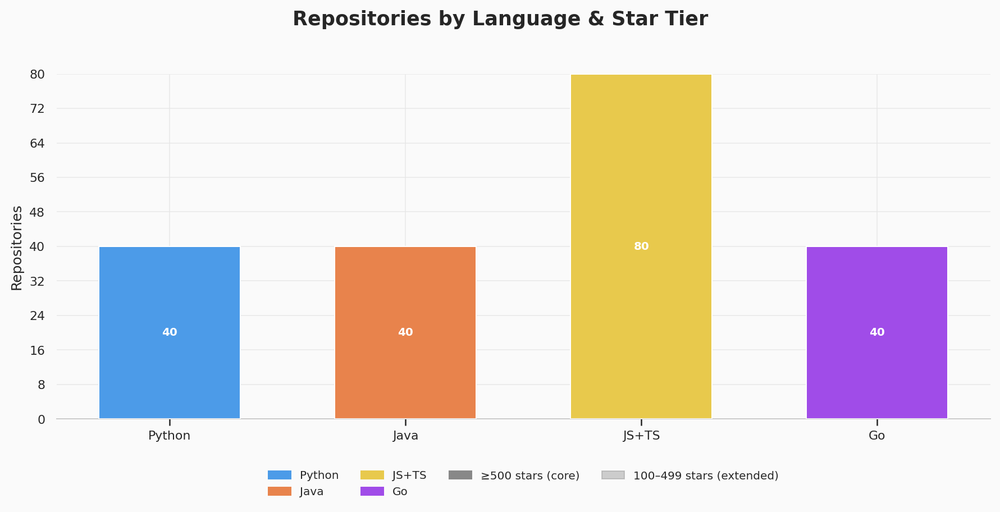

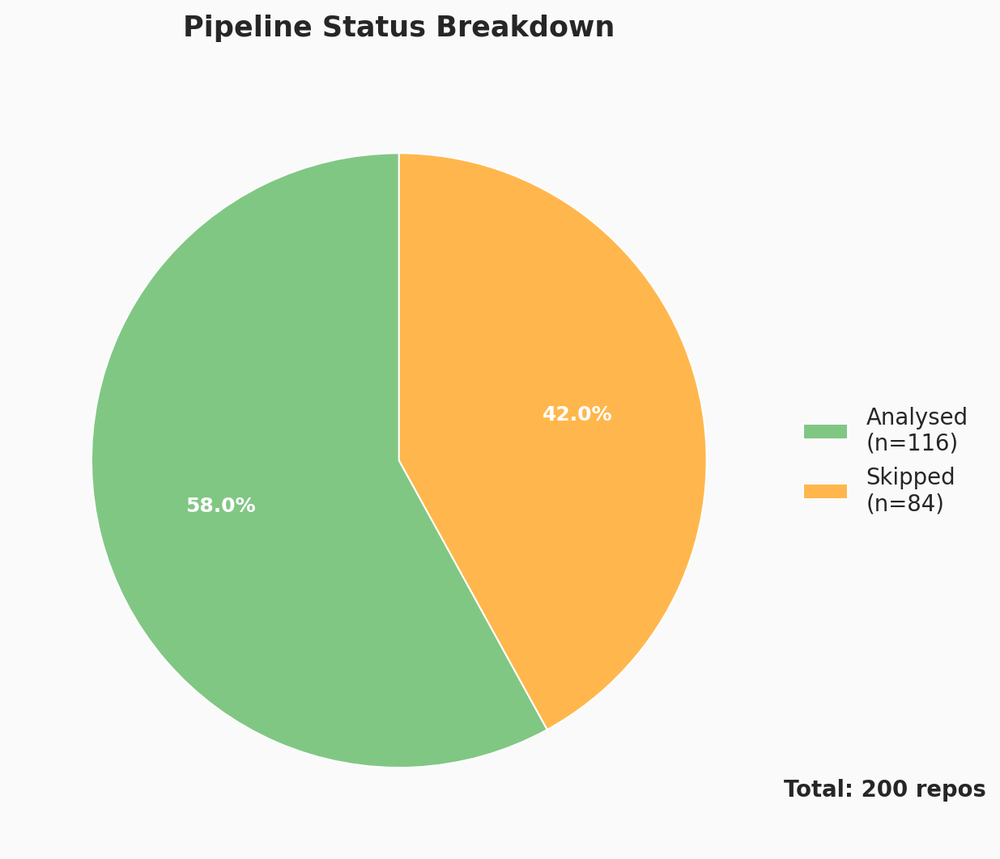

### Repository Timeline & Activity

**Creation Timeline and Activity Patterns**

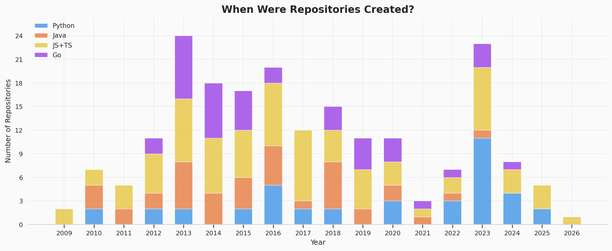

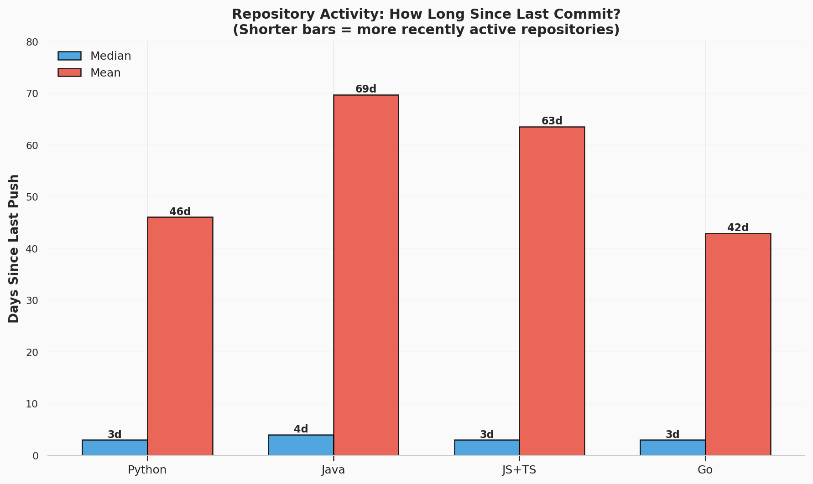

### Fixture Overview

**Fixture Distribution and Scope Patterns**

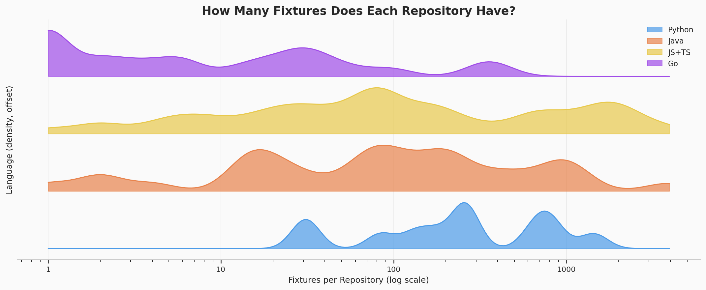

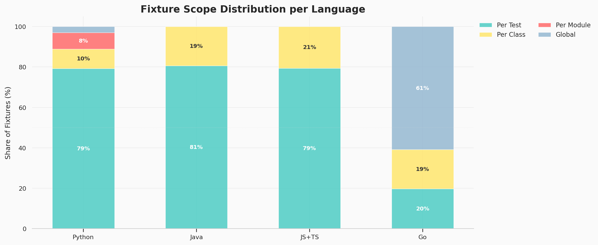

### Mocking Practices

**Mock Usage and Framework Diversity**

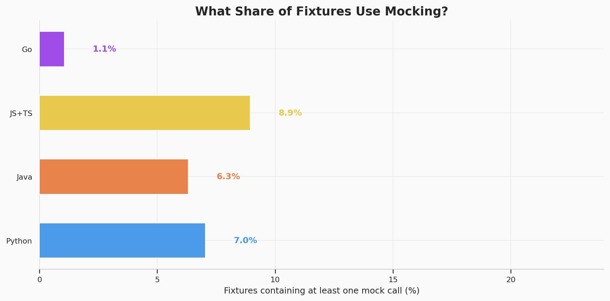

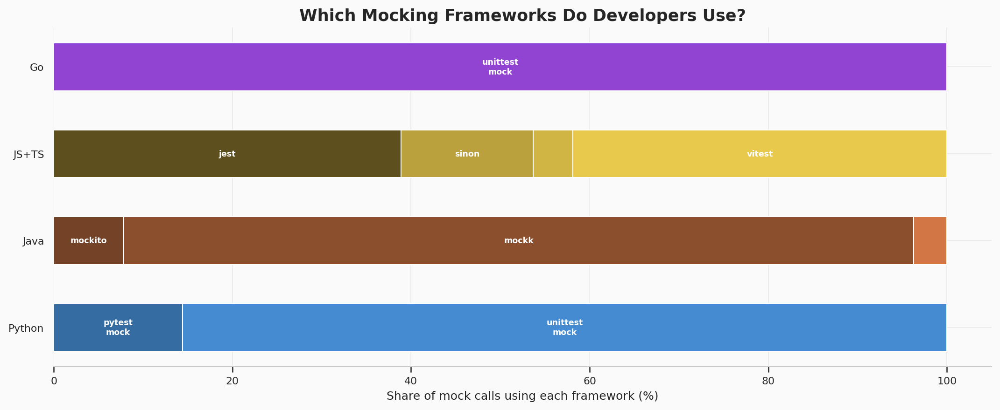

### Fixture Complexity Analysis

**Nesting, Reuse, and Complexity Patterns**

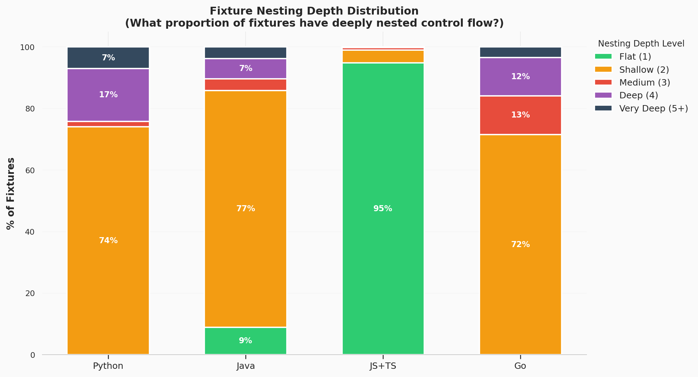

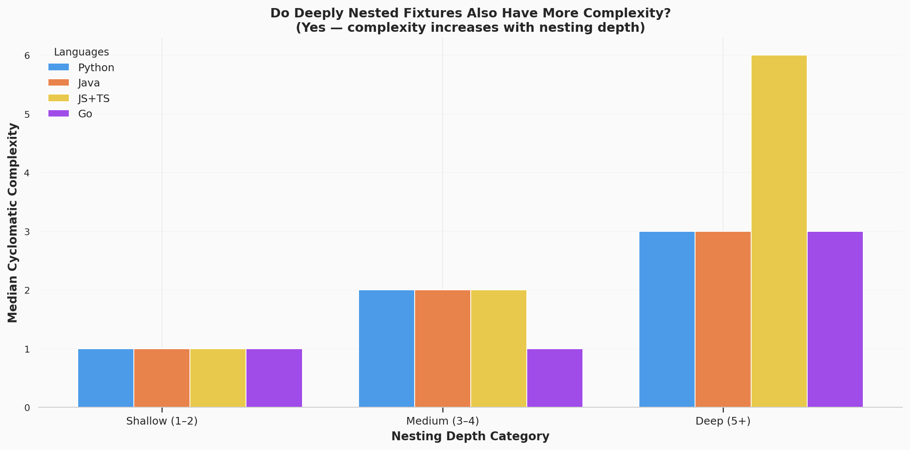

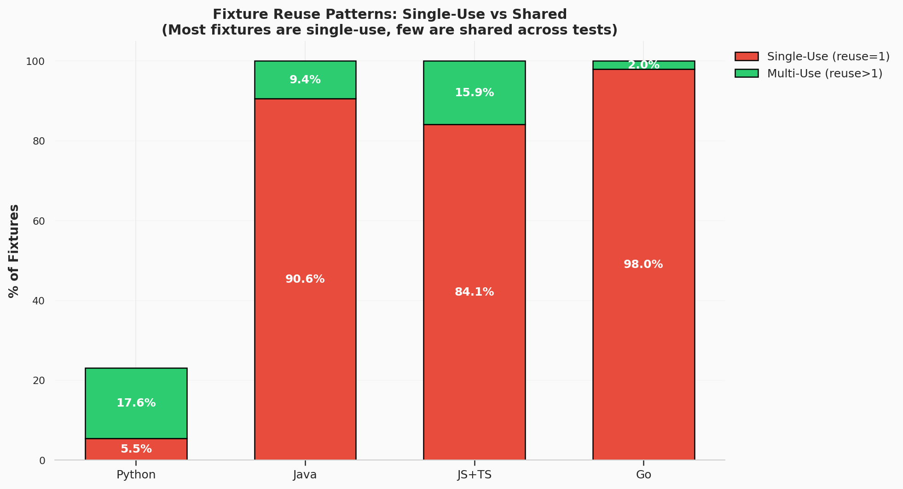

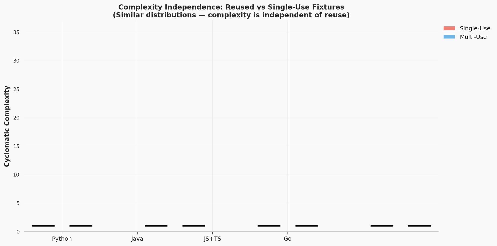

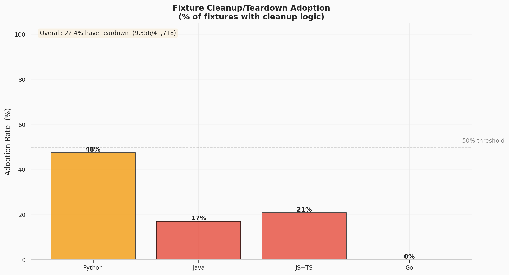