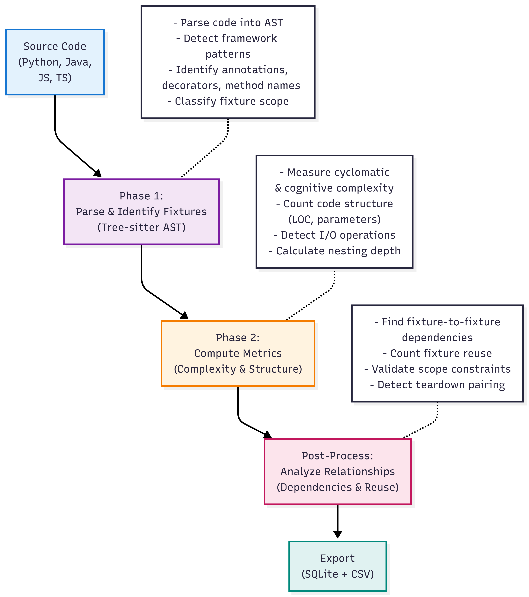
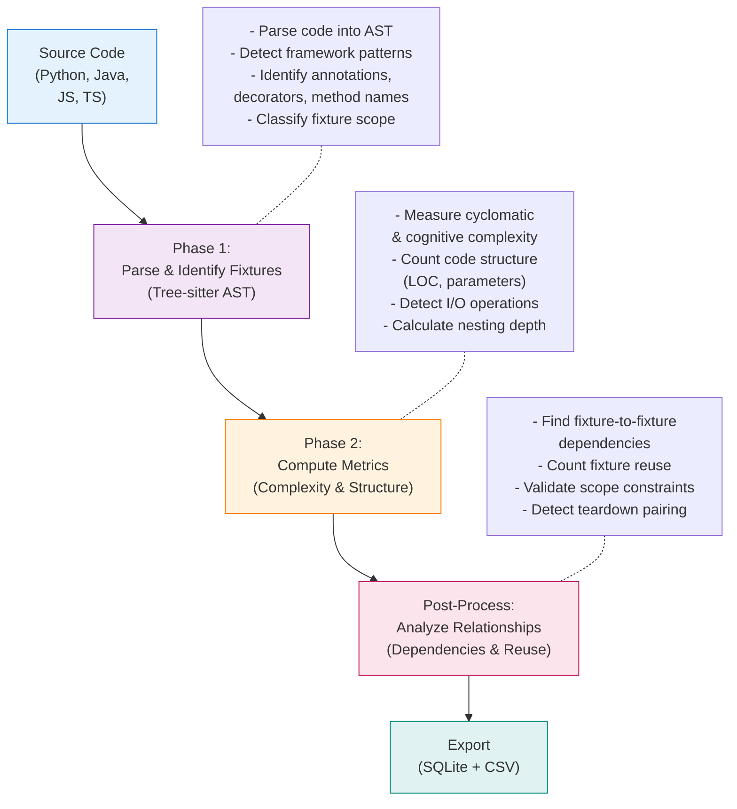

# Fixture Detection Logic

## Executive Summary

FixtureDB detects test fixture definitions across Python, Java, JavaScript, and TypeScript using a **two-phase pipeline**:

1. **Phase 1: AST-Based Detection** — Tree-sitter parses source code into Abstract Syntax Trees (ASTs) to identify fixture-defining constructs (decorators, annotations, method names) with language-specific patterns
2. **Phase 2: Metrics & Relationships** — Computes quantitative metrics (complexity, scope, dependencies) and post-processes to detect fixture relationships and reuse patterns

**Detection Pipeline Overview:**

*For Mermaid diagram source code, see [Appendix: Mermaid Diagram Source](#appendix-mermaid-diagram-source) at the end of this document.*

---

## How Fixtures Are Detected

### Language-Specific Patterns

Fixtures are defined differently across frameworks and languages. We use **framework-specific detection patterns** to identify them accurately:

| Language | Detection Method | Examples |
|----------|-----------------|----------|
| **Python** | Decorators & method names | `@pytest.fixture`, `setUp()`, `@given()` (Behave BDD) |
| **Java** | Annotations & method patterns | `@Before`, `@BeforeEach`, `@BeforeMethod`, `@Bean` (Spring) |
| **JavaScript/TypeScript** | Hook function calls | `beforeEach()`, `beforeAll()`, `before()` (Jest/Mocha) |

**Key Design Decision**: Framework-specific detection is necessary because no general-purpose tool can distinguish between fixture setup, helper functions, and regular methods without understanding framework semantics.

See **[fixture-patterns-reference.md](../usage/fixture-patterns-reference.md)** for complete catalog of 50+ fixture types, detection examples, and patterns across all supported frameworks.

### Scope Classification

All detected fixtures are classified by execution scope:

- **per_test**: Runs before/after each individual test (most common)
- **per_class**: Runs once per test class or suite
- **per_module**: Runs once per test file (Python-specific)
- **global**: Runs once for entire test suite

Scope is consistently mapped across frameworks (e.g., `@Before` = per_test, `@BeforeClass` = per_class in Java; `beforeEach` = per_test, `beforeAll` = per_class in JavaScript).

---

## Fixture Metrics

For each detected fixture, the system computes **14 quantitative metrics** across three categories:

### Code Complexity (3 metrics)

| Metric | Definition | Tool(s) | Notes |
|--------|-----------|---------|-------|
| `cyclomatic_complexity` | McCabe complexity (decision points) | Lizard | Standard metric; Python, Java, JavaScript, TypeScript |
| `cognitive_complexity` | Nesting-aware understandability | Lizard + SonarQube algorithm | Python uses SonarQube standard; others use formula fallback |
| `max_nesting_depth` | Maximum control structure nesting | Tree-sitter AST | Structural measure independent of complexity |

### Code Structure (4 metrics)

| Metric | Definition | Approach | Notes |
|--------|-----------|----------|-------|
| `loc` | Lines of code (non-blank, non-comment) | Lizard | Consistent with industry standard |
| `num_parameters` | Count of parameters in fixture signature | Lizard | Direct extraction |
| `num_objects_instantiated` | Count of object/instance creations | Custom regex | Filters for `new ClassName(...)` patterns |
| `num_external_calls` | Database, HTTP, file I/O operations | Custom regex | Domain-specific; detected via patterns like `open()`, `requests.get()`, `db.query()` |

### Fixture Properties (3 metrics)

| Metric | Definition | Approach |
|--------|-----------|----------|
| `framework` | Testing framework detected | Framework registry + regex |
| `reuse_count` | Number of tests using this fixture | AST analysis |
| `has_teardown_pair` | Cleanup logic paired with setup | AST pattern matching |

### Fixture Relationships (4 metrics, Python/pytest only)

| Metric | Definition | Implementation |
|--------|-----------|-----------------|
| `fixture_dependencies` | Other fixtures this fixture depends on | Parameter injection pattern matching |
| `fixture_scope` | Execution scope (per_test, per_class, etc.) | Annotation/decorator parsing + scope propagation |
| `num_objects_mocked` | Number of mock usages detected | Regex patterns for mock frameworks |
| `raw_source` | Source code snippet | Text extraction |

For detailed metric definitions, calculations, and academic references, see **[metrics-reference.md](metrics-reference.md)**.

---

## Mock Framework Detection

Mock usage is detected in a **second pass** after fixture extraction using regex patterns covering **40+ patterns** across:

- **Python**: `unittest.mock`, `pytest-mock`, `MagicMock`, `patch`, `Mock.assert_*()`
- **Java**: Mockito, EasyMock, PowerMock, MockK
- **JavaScript/TypeScript**: Jest, Sinon, Vitest

For each mock detected, we record:
- **framework**: Mock framework name (e.g., `mockito`, `unittest_mock`, `sinon`)
- **target_identifier**: What is being mocked (if extractable)
- **num_interactions_configured**: Count of assertions/verifications
- **raw_snippet**: Code snippet for manual inspection

---

## Why Certain Metrics Are Custom

**num_external_calls** — We detect I/O operations (database, HTTP, file, network) specifically, not all external function calls. Lizard's `external_call_count` measures architectural coupling; we measure infrastructure dependencies.

**Framework Detection** — No general-purpose tool can distinguish fixtures from helper functions without understanding framework semantics (decorators, method naming conventions, API calls). Custom pattern matching encodes framework-specific knowledge.

---

## Post-Processing & Relationship Detection

**Fixture Reuse Count** — Counts test functions using each fixture (via parameter injection in pytest).

**Teardown Pairing** — Detects cleanup logic paired with setup (Python: `yield` or paired `setUp`/`tearDown`; Java: `@Before`/`@After`; JavaScript: `before`/`after`).

**Fixture Dependencies** (Python/pytest only) — Identifies fixture-to-fixture dependencies via parameter injection.

**Scope Propagation** (Python/pytest only) — Validates scope constraints. If a broader-scoped fixture depends on a narrower-scoped one, downgrades scope automatically.

---

## Supported Frameworks (44+ across 4 languages)

For complete list of supported testing and mocking frameworks with official documentation links, see:

- **[fixture-patterns-reference.md](../usage/fixture-patterns-reference.md)** — Comprehensive catalog of detection patterns and framework examples
- **[metrics-reference.md](metrics-reference.md)** — Tool versions, metric calculations, and academic references

---

## Implementation

Code location: [collection/detector.py](../../collection/detector.py)

Key functions: `extract_fixtures()` (main orchestrator), `detect_*_fixtures()` (language-specific), `detect_mock_usage()` (mock patterns), `compute_metrics()` (quantitative metrics), `post_process_fixtures()` (relationships).

See: [configuration.md](configuration.md), [metrics-reference.md](metrics-reference.md), [fixture-patterns-reference.md](../usage/fixture-patterns-reference.md)

---

## Appendix: Mermaid Diagram Source

The detection pipeline diagram above is generated from the following Mermaid source code. This can be used to regenerate or modify the diagram:

