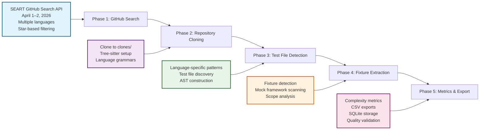

# FixtureDB Pipeline Overview Diagram Source Code

```mermaid
graph LR
    A["Phase 1: GitHub Search"] --> B["Phase 2: Repository Cloning"]
    B --> C["Phase 3: Test File Detection"]
    C --> D["Phase 4: Fixture Extraction"]
    D --> E["Phase 5: Metrics & Export"]
    
    A1["SEART GitHub Search API<br/>April 1–2, 2026<br/>Multiple languages<br/>Star-based filtering"]:::phase1 --> A
    B1["Clone to clones/<br/>Tree-sitter setup<br/>Language grammars"]:::phase2 --> B
    C1["Language-specific patterns<br/>Test file discovery<br/>AST construction"]:::phase3 --> C
    D1["Fixture detection<br/>Mock framework scanning<br/>Scope analysis"]:::phase4 --> D
    E1["Complexity metrics<br/>CSV exports<br/>SQLite storage<br/>Quality validation"]:::phase5 --> E
    
    classDef phase1 fill:#e1f5ff,stroke:#01579b,stroke-width:2px
    classDef phase2 fill:#f3e5f5,stroke:#4a148c,stroke-width:2px
    classDef phase3 fill:#e8f5e9,stroke:#1b5e20,stroke-width:2px
    classDef phase4 fill:#fff3e0,stroke:#e65100,stroke-width:2px
    classDef phase5 fill:#fce4ec,stroke:#880e4f,stroke-width:2px
```