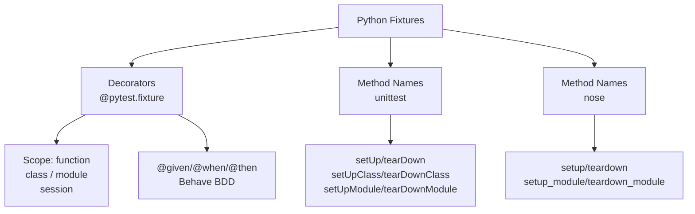
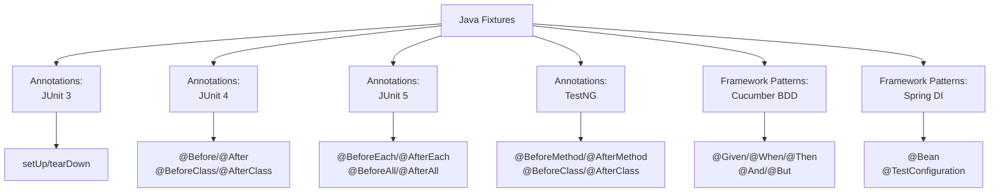
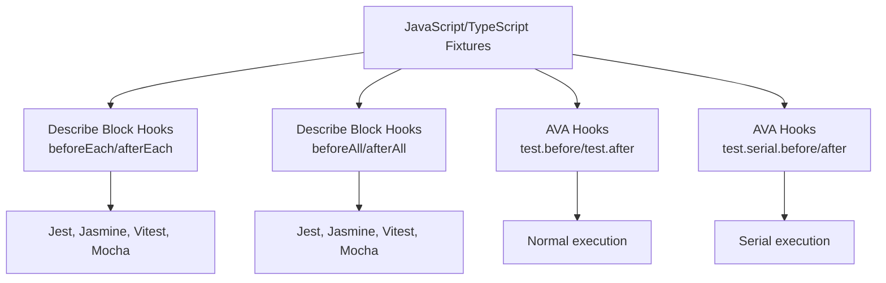

# Fixture Patterns Reference

Comprehensive catalog of 50+ fixture types detected across Python, Java, JavaScript, and TypeScript.

## Fixture Taxonomy Overview

Fixture definitions are organized by **language** and **pattern type**. Each language has distinct mechanisms for declaring fixtures—some use decorators, others use method names or attributes. Detailed taxonomy diagrams for each language are shown in their respective sections below.

**Fixture Scope:** Most frameworks support multiple scopes (per-test, per-class, per-module, global). See each language section for scope details.

## Quick Lookup

| Framework | Language | Fixture Type | Pattern | Scope |
|-----------|----------|--------------|---------|-------|
| pytest | Python | pytest_decorator | `@pytest.fixture` | per_test, per_class, per_module, global |
| unittest | Python | unittest_setup | `def setUp/tearDown/setUpClass/tearDownClass` | per_test, per_class, per_module |
| nose | Python | nose_fixture | `def setup/teardown/setup_module/teardown_module` | per_test, per_module |
| behave | Python | behave_given/when/then/step | `@given/@when/@then/@step(...)` | per_test |
| JUnit 3 | Java | junit3_setup/junit3_teardown | `def setUp()/tearDown()` | per_test |
| JUnit 4 | Java | junit4_before/after/before_class/after_class | `@Before/@After/@BeforeClass/@AfterClass` | per_test, per_class |
| JUnit 5 | Java | junit5_before_each/after_each/before_all/after_all | `@BeforeEach/@AfterEach/@BeforeAll/@AfterAll` | per_test, per_class |
| TestNG | Java | testng_before_method/after_method/before_class/after_class | `@BeforeMethod/@AfterMethod/@BeforeClass/@AfterClass` | per_test, per_class |
| Cucumber | Java | cucumber_given/when/then/and/but | `@Given/@When/@Then/@And/@But(...)` | per_test |
| Spring | Java | spring_bean/spring_test_config | `@Bean/@TestConfiguration` | per_class |
| Jest/Mocha/Jasmine/Vitest | JavaScript | before_each/after_each/before_all/after_all | `beforeEach/afterEach/beforeAll/afterAll(...)` | per_test, per_class |
| Mocha | JavaScript | mocha_before/mocha_after | `before/after(...)` | per_test |
| AVA | JavaScript/TypeScript | ava_before/after/serial_before/serial_after | `test.before/.after/.serial.before/.serial.after(...)` | per_test, per_class |

---

## Python Fixtures

### Fixture Taxonomy (Python)

```
Python Fixtures
├── Decorators
│   ├── @pytest.fixture
│   └── @given/@when/@then (Behave BDD)
├── Method Names (unittest/nose)
│   ├── setUp/tearDown
│   ├── setUpClass/tearDownClass
│   ├── setUpModule/tearDownModule
│   └── setup/teardown (nose)
└── Scope: per_test, per_class, per_module, global
```

### pytest Fixtures

**Pattern:** `@pytest.fixture` decorator  
**Scope:** Configurable via `scope="function|class|module|session"`

### unittest Fixtures

**Pattern:** Method names: `setUp()`, `tearDown()`, `setUpClass()`, `tearDownClass()`, `setUpModule()`, `tearDownModule()`  
**Scope:** Determined by method name and class context

### nose Fixtures

**Pattern:** Module/package functions: `setup()`, `teardown()`, `setup_module()`, `teardown_module()`, `setup_package()`, `teardown_package()`  
**Scope:** Module or package level

---

## Java Fixtures

### Fixture Taxonomy (Java)

```
Java Fixtures
├── Annotations
│   ├── JUnit 3: setUp/tearDown (methods)
│   ├── JUnit 4: @Before/@After/@BeforeClass/@AfterClass
│   ├── JUnit 5: @BeforeEach/@AfterEach/@BeforeAll/@AfterAll
│   └── TestNG: @BeforeMethod/@AfterMethod/@BeforeClass/@AfterClass
├── Framework Patterns
│   ├── Cucumber: @Given/@When/@Then/@And/@But (BDD)
│   └── Spring: @Bean/@TestConfiguration (Dependency Injection)
└── Scope: per_test, per_class, per_module (via @BeforeAll)
```

### JUnit 3 (Legacy)

**Pattern:** Method names: `setUp()`, `tearDown()`  
**Scope:** per_test

### JUnit 4

**Pattern:** Annotations: `@Before`, `@After`, `@BeforeClass`, `@AfterClass`  
**Scope:** Determined by annotation type

### JUnit 5

**Pattern:** Annotations: `@BeforeEach`, `@AfterEach`, `@BeforeAll`, `@AfterAll`  
**Scope:** Determined by annotation type

### TestNG

**Pattern:** Annotations: `@BeforeMethod`, `@AfterMethod`, `@BeforeClass`, `@AfterClass`  
**Scope:** Method or class level

### Cucumber / BDD (Java)

**Pattern:** Annotations: `@Given(...)`, `@When(...)`, `@Then(...)`, `@And(...)`, `@But(...)`  
**Scope:** per_test

### Spring Framework

**Pattern:** Annotations: `@Bean`, `@TestConfiguration`, `@Configuration`  
**Scope:** per_class (application context scope)
    public static void teardownClass() {
        // Runs once after all tests in this class
        sharedResource.close();
    }
    
    @Test
    public void testSomething() {
        assertNotNull(perTestResource);
    }
}
```

**Scope Mapping:**
- `@Before` → per_test
- `@After` → per_test
- `@BeforeClass` → per_class
- `@AfterClass` → per_class

**Detection Logic:**
1. Find `method_declaration` nodes
2. Scan for `modifiers` child with annotations
3. Extract annotation name (`@Before`, etc.)
4. Look up in JUNIT_FIXTURE_ANNOTATIONS dict

---

### JUnit 5 (Jupiter)

**Type:** `junit5_before_each`, `junit5_after_each`, `junit5_before_all`, `junit5_after_all`  
**Framework:** JUnit 5  
**Pattern:** Methods annotated with `@BeforeEach`, `@AfterEach`, `@BeforeAll`, `@AfterAll`

```java
import org.junit.jupiter.api.BeforeEach;
import org.junit.jupiter.api.AfterEach;
import org.junit.jupiter.api.BeforeAll;
import org.junit.jupiter.api.AfterAll;
import org.junit.jupiter.api.Test;

public class MyTest {
    @BeforeAll
    static void setupOnce() {
        // Runs once before all tests
        System.out.println("Suite setup");
    }
    
    @BeforeEach
    void setUp() {
        // Runs before each test
        System.out.println("Test setup");
    }
    
    @AfterEach
    void tearDown() {
        // Runs after each test
        System.out.println("Test teardown");
    }
    
    @AfterAll
    static void tearDownOnce() {
        // Runs once after all tests
        System.out.println("Suite teardown");
    }
    
    @Test
    void testSomething() {
        // test code
    }
}
```

**Scope Mapping:**
- `@BeforeEach` → per_test
- `@AfterEach` → per_test
- `@BeforeAll` → per_class
- `@AfterAll` → per_class

---

### TestNG

**Type:** `testng_before_method`, `testng_after_method`, `testng_before_class`, `testng_after_class`, `testng_data_provider`  
**Framework:** TestNG  
**Pattern:** Methods annotated with TestNG annotations

```java
import org.testng.annotations.BeforeMethod;
import org.testng.annotations.AfterMethod;
import org.testng.annotations.BeforeClass;
import org.testng.annotations.AfterClass;
import org.testng.annotations.DataProvider;
import org.testng.annotations.Test;

public class MyTest {
    @BeforeClass
    public void setupClass() {
        // Class-level setup
    }
    
    @BeforeMethod
    public void setup() {
        // Per-test setup
    }
    
    @DataProvider(name = "testData")
    public Object[][] dataProvider() {
        // Returns data for parametrized tests
        return new Object[][] {
            {1, 2},
            {3, 4}
        };
    }
    
    @Test(dataProvider = "testData")
    public void testWithData(int a, int b) {
        // Test using data from provider
    }
    
    @AfterMethod
    public void teardown() {
        // Per-test cleanup
    }
    
    @AfterClass
    public void teardownClass() {
        // Class-level cleanup
    }
}
```

**Scope Mapping:**
- `@BeforeMethod` → per_test
- `@AfterMethod` → per_test
- `@BeforeClass` → per_class
- `@AfterClass` → per_class
- `@DataProvider` → per_test

---

### Cucumber (BDD)

**Type:** `cucumber_given`, `cucumber_when`, `cucumber_then`, `cucumber_and`, `cucumber_but`  
**Framework:** Cucumber (for Java)  
**Pattern:** Methods annotated with `@Given(...)`, `@When(...)`, `@Then(...)`

```java
import io.cucumber.java.en.Given;
import io.cucumber.java.en.When;
import io.cucumber.java.en.Then;

public class LoginStepDefinitions {
    private User user;
    private Application app;
    
    @Given("a user with username {string} and password {string}")
    public void givenUser(String username, String password) {
        user = new User(username, password);
    }
    
    @When("the user logs in")
    public void whenUserLogsIn() {
        app.login(user.username, user.password);
    }
    
    @Then("the user should be authenticated")
    public void thenUserAuthenticated() {
        assert app.isAuthenticated(user);
    }
    
    @And("the dashboard should be displayed")
    public void andDashboardDisplayed() {
        assert app.getDashboard() != null;
    }
    
    @But("no error message should appear")
    public void butNoErrorMessage() {
        assert !app.hasError();
    }
}
```

**Scope:** Always per_test (each step definition is evaluated per scenario)

**Gherkin Feature Files (Content, not Fixture Type):**
```gherkin
Feature: User Login
  Scenario: Valid credentials
    Given a user with username "john" and password "secret"
    When the user logs in
    Then the user should be authenticated
    And the dashboard should be displayed
    But no error message should appear
```

---

### Spring Framework

**Type:** `spring_bean`, `spring_test_config`  
**Framework:** Spring, Spring Boot Test  
**Pattern:** Methods annotated with `@Bean`, `@TestConfiguration`

```java
import org.springframework.boot.test.context.SpringBootTest;
import org.springframework.boot.test.context.TestConfiguration;
import org.springframework.context.annotation.Bean;
import org.junit.jupiter.api.Test;
import org.springframework.beans.factory.annotation.Autowired;

@SpringBootTest
public class MyApplicationTest {
    
    @TestConfiguration
    static class TestConfig {
        
        @Bean
        public UserRepository userRepository() {
            // Create a test-specific bean
            return new InMemoryUserRepository();
        }
        
        @Bean
        public EmailService emailService() {
            // Create a mock or stub email service
            return mock(EmailService.class);
        }
    }
    
    @Autowired
    private UserRepository userRepository;
    
    @Autowired
    private EmailService emailService;
    
    @Test
    public void testUserCreation() {
        // Test using injected beans
        User user = userRepository.save(new User("john"));
        emailService.sendWelcomeEmail(user);
    }
}
```

**Scope:**
- `@Bean` → per_class (bean is created once per test class)
- `@TestConfiguration` → per_class (configuration applies to entire test class)

---

## JavaScript & TypeScript Fixtures

### Fixture Taxonomy (JavaScript/TypeScript)

```
JavaScript/TypeScript Fixtures
├── Describe Block Hooks (Most frameworks)
│   ├── beforeEach/afterEach (per-test)
│   ├── beforeAll/afterAll (per-suite)
│   └── Supported by: Jest, Jasmine, Vitest, Mocha
├── AVA Hooks (Serial execution)
│   ├── test.before/test.after
│   └── test.serial.before/test.serial.after
└── Scope: per_test (beforeEach/afterEach, test.before)
         per_class (beforeAll/afterAll)
         serial (AVA serial hooks)
```

### Jest/Jasmine/Vitest (Standard Hooks)

**Type:** `before_each`, `after_each`, `before_all`, `after_all`  
**Frameworks:** Jest, Jasmine, Vitest  
**Pattern:** Hook functions: `beforeEach()`, `afterEach()`, `beforeAll()`, `afterAll()`

```javascript
describe('User Service', () => {
    let userService;
    let database;
    
    // Runs once before all tests in this suite
    beforeAll(() => {
        database = new Database();
        database.connect();
    });
    
    // Runs before each test
    beforeEach(() => {
        userService = new UserService(database);
        jest.clearAllMocks();
    });
    
    // Runs after each test
    afterEach(() => {
        userService = null;
    });
    
    // Runs once after all tests in this suite
    afterAll(() => {
        database.disconnect();
    });
    
    test('should create user', () => {
        const user = userService.create('john');
        expect(user.name).toBe('john');
    });
});
```

**Scope Mapping:**
- `beforeEach` → per_test
- `afterEach` → per_test
- `beforeAll` → per_class
- `afterAll` → per_class

---

### Mocha (Ambiguous Hooks)

**Pattern:** `before()`, `after()` — Scope determined by nesting (per-test by default)

### AVA

**Pattern:** `test.before()`, `test.after()`, `test.serial.before()`, `test.serial.after()`  
**Scope:** Serial/non-serial determines per-test vs. per-class behavior

---

## BDD Frameworks

### Feature: BDD-Style Testing

BDD (Behavior-Driven Development) frameworks structure tests around human-readable scenarios describing desired behavior.

**Supported Frameworks:**

1. **Behave** (Python)
   - Step definitions: `@given`, `@when`, `@then`, `@step`
   - Feature files: `.feature` files with Gherkin syntax
   - Scope: per_test (each step is part of a scenario)

2. **Cucumber** (Java, JavaScript)
   - Step definitions: `@Given`, `@When`, `@Then`, `@And`, `@But`
   - Feature files: `.feature` files with Gherkin syntax
   - Scope: per_test (each step definition runs as part of scenario execution)

**Example BDD Test Flow:**
```
Feature: User Login          ← Feature file
  Scenario: Valid login      ← Scenario (test)
    Given a user exists      ← Step definition 1 (behave_given)
    When user logs in        ← Step definition 2 (behave_when)
    Then user is authenticated ← Step definition 3 (behave_then)
```

**Detection Strategy:**
- BDD fixtures are detected by decorator patterns: `@given(...)`, `@when(...)`, `@then(...)`
- Each step definition is a separate fixture_type
- Scope is always per_test (steps are evaluated during scenario execution)
- Framework detection: identify which BDD tool based on import statements

---

## Spring Framework

### Feature: Spring Dependency Injection & Configuration

Spring provides test fixtures via configuration classes and bean factories.

**Key Annotations:**

1. **@TestConfiguration** — Test-specific bean definitions
   ```java
   @TestConfiguration
   public class MockConfig {
       @Bean
       public UserService userService() {
           return mock(UserService.class);
       }
   }
   ```

2. **@Bean** — Factory method for bean creation
   ```java
   @Bean
   public Database database() {
       return new InMemoryDatabase();
   }
   ```

3. **@MockBean** — Mock bean injection
   ```java
   @SpringBootTest
   public class MyTest {
       @MockBean
       private UserRepository repo;
   }
   ```

4. **@SpyBean** — Spy on real beans
   ```java
   @SpringBootTest
   public class MyTest {
       @SpyBean
       private UserService service;
   }
   ```

**Scope:**
- Spring fixtures are per_class (configuration applies to entire test class)
- Dependencies injected via @Autowired are created per-class

**Detection Strategy:**
- Detect `@Bean` and `@TestConfiguration` annotations in method declarations
- Look for classes nested inside test classes (inner @TestConfiguration classes)
- Scope: always per_class

---

## Fixture Relationships

### Fixture Dependency Tracking

Fixture relationships capture how fixtures depend on each other:

```
Example: pytest fixture dependency

@pytest.fixture(scope="session")
def database():
    db = Database.open()
    yield db
    db.close()

@pytest.fixture
def user(database):  # ← depends on 'database' fixture
    user = User.create(database)
    yield user
    user.delete()

def test_user_profile(user):  # ← depends on 'user' fixture
    assert user.id is not None
```

**Relationship Types:**

1. **Direct Dependency** — Fixture A requires Fixture B as a parameter
   ```python
   def fixture_a(fixture_b):  # A depends on B
       pass
   ```

2. **Scope Hierarchy** — Broader-scope fixtures enable narrower-scope fixtures
   ```python
   @pytest.fixture(scope="module")
   def module_db():  # Broader scope
       pass
   
   @pytest.fixture(scope="function")
   def test_db(module_db):  # Narrower scope depends on broader
       pass
   ```

3. **Framework Nesting** — Describe blocks nest beforeEach hooks
   ```javascript
   describe("outer", () => {
       beforeAll(() => setup1());
       
       describe("inner", () => {
           beforeAll(() => setup2());  // setup2 runs after outer setup1
       });
   });
   ```

**Future Enhancement:**
The FixtureDB can track fixture relationships to:
- Build fixture dependency graphs
- Analyze fixture initialization order
- Detect circular dependencies
- Optimize fixture reuse

---

---

## See Also

- [detection.md](../architecture/detection.md) — How fixtures are detected (technical overview)
- [metrics-reference.md](../architecture/metrics-reference.md) — Quantitative metrics extracted per fixture

---

## Appendix: Language-Specific Fixture Taxonomy

The fixture taxonomy diagrams above are generated from the following Mermaid source code. These can be used to regenerate or modify the diagrams:

### Python Fixture Taxonomy



### Java Fixture Taxonomy



### JavaScript/TypeScript Fixture Taxonomy



